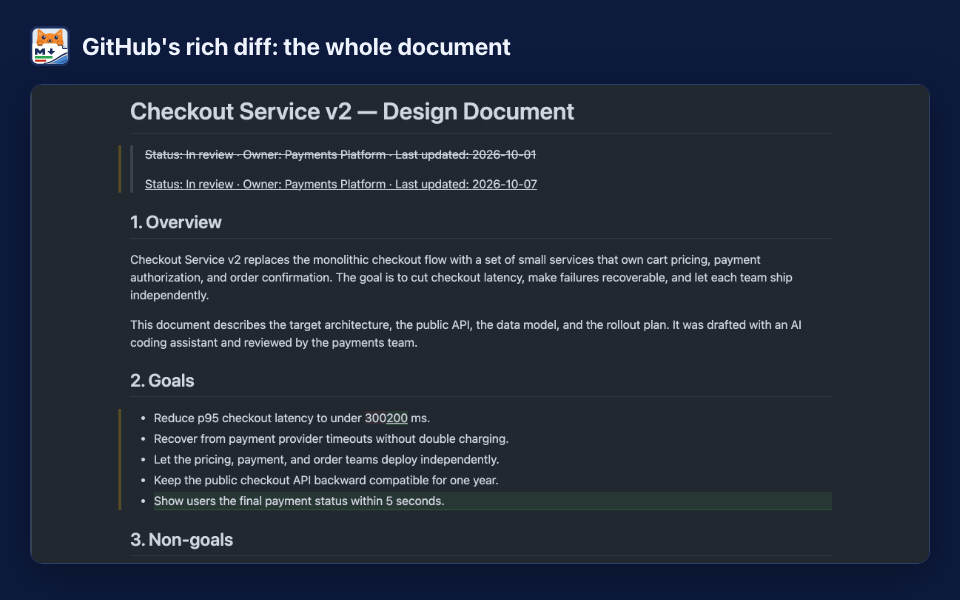
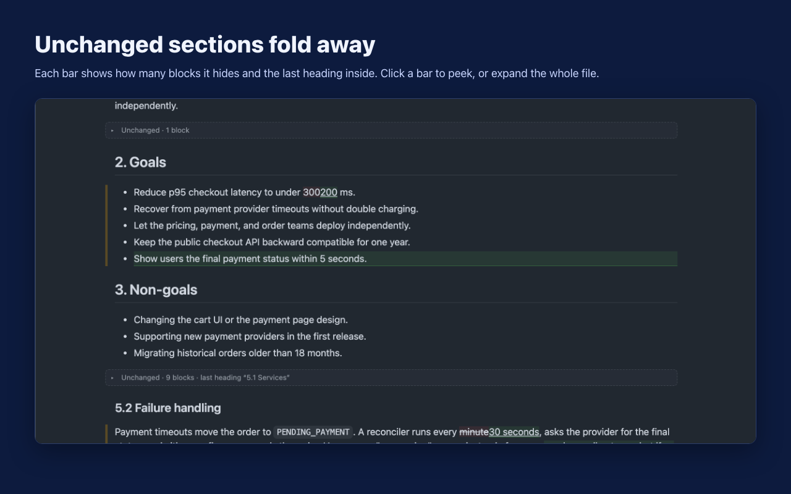
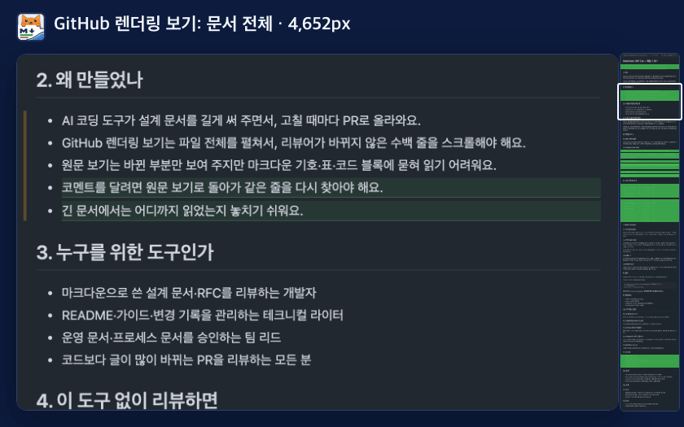
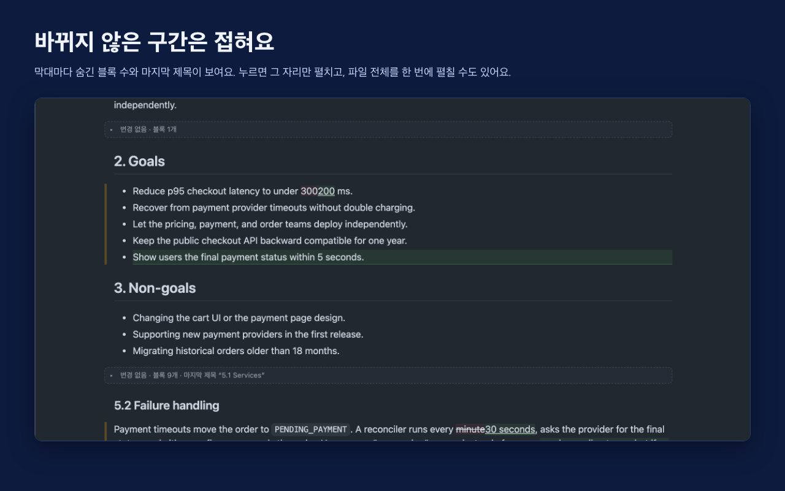

<p align="center"></p>

<h1 align="center">Markdown Diff Cat for GitHub</h1>

<p align="center">See only what changed in Markdown files on GitHub pull requests — rendered, not raw.</p>

<p align="center"><a href="#한국어">한국어</a></p>



## Why

AI coding assistants write long design documents, and reviewing them in a pull request is painful:

- **Rich diff** (the rendered view) opens the whole file. You scroll past hundreds of unchanged lines to find the few that changed.
- **Source diff** shows only the changes, but they are buried in Markdown syntax, table pipes, and code fences.

Markdown Diff Cat gives you both: the rendered document, with only the changes in view.

## What it does

- **Opens the rendered view for you** on every `.md`, `.markdown`, and `.mdx` file on the "Files changed" page
- **Folds unchanged sections** into one-line bars that show how many blocks they hide and the last heading inside. Click a bar to expand it, or **Expand all** at the top of the file
- **Shows only the changed rows of tables.** When one row changes, GitHub shows the whole old table and the whole new table. Markdown Diff Cat merges them into one table with only the changed, added, and removed rows, and shows changed cells as old → new. **All rows** and **Original tables** buttons sit above each merged table
- **Jump between changes.** The top of each file says how many places changed and how many review threads it has, with how many are still open ("8 changes · 3 threads (3 open)"). Press `]` / `[` for the next or previous change on the page and `}` / `{` for the next or previous thread, or use ↑ ↓ to move within one file. The keys do nothing while you type
- **Comment right in the rendered view** (signed in to GitHub)
  - Hover over a block and click **+**, or drag from **+** to another block to comment on a range
  - The comment lands on the right source line as an ordinary GitHub review comment: add a single comment, or start or add to your review
  - Existing review threads show under the block they refer to, where you can reply and resolve them. Comments on the whole file show at the top of the file
  - **Preview** your comment the way GitHub will show it, and **edit** or **delete** your own comments in place (delete asks for a second click)
  - The comment box looks like GitHub's own: your avatar and the line (`R13`, or `L25` on the removed side), Write / Preview tabs, the formatting toolbar (a **suggestion** button that drops the commented lines into a ```` ```suggestion ```` block, heading, bold, italic, quote, code, link, lists, task list, mention, with ⌘/Ctrl+B, I, E, K), and **Comment** and **Start a review** stay off until you type. Reply boxes have the same toolbar, suggestion button included
  - The extension's text is in English, to match GitHub's own pages, which are English only

  
- **Stays out of your way**
  - Click `<>` (source) on a file to leave a comment and it will not switch that file back until you choose the rich diff again or reload
  - Signed out, files that already have inline review comments stay in the source view, because only signed-in users see threads in the rendered view
  - Collapsed files (collapsed or marked **Viewed**) stay collapsed
- **One click on or off.** The toolbar icon is in color when on and gray when off. A `!` badge appears only when the page could not be read; hover over it for the reason

Works on both "Files changed" pages: the new one for signed-in users (`/pull/<n>/changes`) and the classic one (`/pull/<n>/files`).

## Install

**Chrome Web Store** — [Markdown Diff Cat for GitHub](https://chromewebstore.google.com/detail/markdown-diff-cat-for-git/kabekbbeoajhpbcppidepmcbbjjochlj)

If Enhanced Safe Browsing is on, Chrome may say "Proceed with caution" because the extension is not trusted by Enhanced Safe Browsing yet. Google trusts extensions from publishers that follow its policies, and new publishers usually take a few months ([Chrome Web Store Help](https://support.google.com/chrome_webstore/answer/2664769)). Choose **Continue to install**.

Release notes: [GitHub Releases](https://github.com/drum-grammer/GITHUB-MD-DIFF/releases)

**Try a build before it reaches the store (developer mode)**

You need Node 22.18 or later and pnpm 12 (`corepack enable` picks the pinned version). `main` is the latest build that has not reached the store yet.

```sh
git clone https://github.com/drum-grammer/GITHUB-MD-DIFF.git && cd GITHUB-MD-DIFF
```

To update later: `git pull && pnpm install && pnpm dev:chrome`. To try an open pull request instead: `gh pr checkout <number>`, then `pnpm install && pnpm dev:chrome`.

1. `pnpm install && pnpm dev:chrome` — builds a development copy into `~/.local/share/github-md-diff/chrome-dev` (set `GMD_CHROME_DEV_DIR` to change it; it refuses a folder that holds anything else) and, on macOS, copies that path to the clipboard. `--open` also opens `chrome://extensions`
2. First time only: `chrome://extensions` → turn on **Developer mode** → **Load unpacked** → choose that folder (`Cmd+Shift+G` and paste on macOS). Turn off the store version while you test, or both will change the same page
3. After that, run `pnpm dev:chrome` from any branch and reload a GitHub tab. The development copy notices the new build, reloads itself, and reloads that tab. It shows as **Markdown Diff Cat (dev)**, with the commit in its version

The self-reload lives in `src/dev/` and is only in this development copy, never in `pnpm build` or `pnpm package`.

## Privacy

No data collected and no remote code. The extension reads the open GitHub page inside your browser to change how it is displayed. When you are signed in, it also talks to GitHub, and only to GitHub, with the session you already have: it loads the pull request's review threads and the Markdown files it shows, and posts the comments you write. Nothing goes to the developer or anyone else, and no token is used. Its one setting (on or off) stays in `chrome.storage.local`. Permissions: `storage`, and access to `https://github.com/*`. Full policy: [PRIVACY.md](PRIVACY.md).

## Limits

- Files renamed without changes stay in the source view, since there is nothing to render. Large diffs that GitHub hides behind **Load Diff** are still opened in the rendered view. If GitHub fails to build the rendered view of a file (it times out on some large files), the file goes back to the source view after 15 seconds, and it is not reported as a problem
- When an edit does not change what the page looks like (Markdown syntax, a link URL, an escaped character), the rendered view has nothing to highlight. The file says so at the top, with a **Show source diff** button
- In a pull request with many Markdown files, it asks GitHub for at most 10 rendered views at a time, starting with the files on screen. Files further down render as you scroll to them
- It relies on GitHub's page structure. When GitHub changes it, the icon shows `!` until an update ships. Please [open an issue](https://github.com/drum-grammer/GITHUB-MD-DIFF/issues)
- Commenting uses the same internal requests as GitHub's own "Files changed" page, which are not a public API. They live only in `src/github-api.ts`. If GitHub changes them, the extension turns commenting off on its own: no **+**, files with review threads stay in the source view as before, and folding and tables keep working. The toolbar icon shows `!`, and a note in the corner of the page has a **Report on GitHub** link that opens a prefilled issue (no repository name or URL in it). A comment that fails to post stays in its box so you can copy it
- A block gets **+** only when it can be matched to its source lines. Blocks GitHub draws from HTML or diagrams may not get one; use the source diff for those

## Develop

- `pnpm test` — unit and DOM tests (vitest + jsdom)
- `pnpm typecheck`
- `pnpm e2e:login` once — sign in to GitHub in the window that opens, then close it. The profile lives in `~/.cache/github-md-diff/e2e-profile` (outside the repo)
- `pnpm e2e` — real Chromium with the extension against public pull requests, signed in and signed out
- `GMD_E2E_WRITE=1 pnpm e2e` — also posts comments from the rendered view to the demo pull request as a pending review, checks their source lines, and deletes the review with `gh` (needs `gh` signed in as the repository owner)
- `pnpm canary [--notify]` — read-only check against live GitHub of everything the extension relies on: signed-in pull request data, file text, auto rich diff, folding, merged tables, **+** on the right line, matching rate, and the signed-out classic page. Exit code 1 when something broke; results go to `~/.cache/github-md-diff/canary.log`. `--notify` shows a macOS notification and prints a prefilled issue link. The maintainer runs it weekly on an always-on Mac; when it breaks or recovers, `.github/workflows/canary-report.yml` (manual dispatch only) has the Actions bot open, update, or close an issue labeled `canary`
- `node scripts/mapping-report.mjs <pull request URL>…` (after `pnpm build`) — how many rendered blocks of each Markdown file match their source lines, and how long matching takes. Read-only
- `pnpm explore:pick` then `pnpm explore` — open recent Markdown pull requests from the public repositories in `scripts/explore-repos.txt` (up to 3 per repository) with the extension, and record per file whether it rendered, folded, went back to the source view, showed a note, got **+**, and how many blocks match their source lines, with screenshots of files that look wrong. Read-only (it only hovers), resumable, results in `.scratch/explore/<date>/`. `pnpm explore:report` summarizes them. Run it before a release that touches page handling
- `pnpm perf [--reps 2] [--window 20] [pull request URL…]` — how much the extension slows GitHub down: opens each pull request with the extension off and on, and records the extension's own CPU time (from a CPU profile, with its busiest functions), long tasks and total blocking time, page script and layout time, how long Markdown files take to render, the delay from GitHub's rendered diff to folding, and how long the first **+** takes on the largest file. Without URLs it uses eight public pull requests from 1 to 334 Markdown files. Read-only
- `pnpm testbed:setup` then `pnpm testbed` — release scenarios on the public test repository [markdown-diff-cat-testbed](https://github.com/drum-grammer/markdown-diff-cat-testbed): post real comments from the rendered view (single line, range, removed line, reply, renamed file), resolve and unresolve threads, check that existing threads land under the right blocks, and open a large diff and a 120-file pull request. Every comment is read back through the GitHub API (path, side, line) and deleted afterwards. `testbed:setup` creates or repairs the repository, its pull requests, and seeded threads, and is safe to run again. `pnpm testbed:report` prints the results table and a line for the release notes. Needs `gh` signed in as the repository owner. See [testbed/README.md](testbed/README.md). It runs as part of `pnpm verify pr` (Split) and `pnpm verify release` (all five diff layouts)
- `pnpm icons` — regenerate `static/icons/icon{16,32,48,128}.png` from `icon.svg` and `icon{16,32}-off.png` from `icon-off.svg` (commit the PNGs)
- `pnpm package` — build and zip `dist/` into `release/` for the Chrome Web Store
- `pnpm release <check|notes|upload|submit|status|finish>` — publish an update to the Chrome Web Store through its API. See [store/README.md](store/README.md#releasing-an-update)
- `pnpm store:assets` — regenerate the store screenshots, promo tiles, and `docs/demo.gif`. See [store/README.md](store/README.md)
- GitHub page assumptions live only in `src/selectors.ts`, and GitHub request assumptions only in `src/github-api.ts`
- Test fixtures must come from public repositories or be handmade; the first line records the source and `test/fixtures.test.ts` checks it

### Verification tiers

One command per tier. Each runs its steps in order, keeps going after a failure, and writes a formatted report (steps, results, time, and the scenario tables) to `.scratch/verify/<date-time>-<tier>/report.md`. The exit code is 1 when anything failed.

| Tier | When | Steps | Time (2026-10-09) |
|---|---|---|---|
| `pnpm verify quick` | While you work | typecheck, unit tests, build, test repository setup, the `@quick` scenarios (read-only: rendering, existing threads, **+** lines, change navigation) | about 45 seconds |
| `pnpm verify pr` | Before merging a pull request | typecheck, unit tests, build, end-to-end tests with writes, canary, every test repository scenario in the Split layout | about 6 minutes |
| `pnpm verify release` | Before asking the Chrome Web Store for review | everything in `pr`, the layout-sensitive scenarios in all five GitHub diff layouts (Split, Unified, Hide whitespace, Minimize comments, Compact line height), a re-exploration of 16 public pull requests (`scripts/explore-regress.jsonl`), performance with the extension off and on, and the store package | about 16 minutes |

`pnpm verify --list` prints the steps. `--bail` stops at the first failure and `--skip step,…` leaves steps out. `pr` and `release` post real comments to the test repository and need `gh` and the signed-in test profile (see [testbed/README.md](testbed/README.md)). The Minimize comments and Compact line height layouts exist only as GitHub account settings, so `release` turns them on for its run and restores them afterwards.

## Roadmap

[ROADMAP.md](ROADMAP.md) says where development stands and what comes next, written so anyone can pick up the work without other context (Korean, with an English summary). As of 2026-10-11 the Chrome Web Store has 1.0.0 and `main` has 1.5.0. The maintainer uses each version in developer mode before asking for the next store review.

## Research and test reports

Each report is in Korean with an English summary at the top.

| Date | Report | What it found |
|---|---|---|
| 2026-10-09 | [1.3.0 testing](docs/reports/v1.3.0-testing.md) | Test repository v2 (4 pull requests, 11 seeded threads, 24 scenarios) in five GitHub diff layouts. 1.2.0 passed 51 of 57, because comments on the whole file were missing in every layout. 1.3.0 passes 60 of 60. The three verification tiers take 43 s, 5 min 35 s, and 15 min 29 s |
| 2026-10-08 | [1.1.1 test repository](docs/reports/v1.1.1-testbed.md) | Scenarios that post real comments and read them back through the API. The first run passed 10 of 14 and found footnotes defined mid-document getting no **+**. The final run passed 14 of 14 in 131 s |
| 2026-10-08 | [1.1.1 verification](docs/reports/v1.1.1-verification.md) | Issue [#22](https://github.com/drum-grammer/GITHUB-MD-DIFF/issues/22), then 300 Markdown pull requests in 128 public repositories: false alerts went from 3 to 0 and source-line matching from 98.4% to 99.7%. In a pull request with 334 Markdown files, the extension's own CPU time dropped from 1,182 ms to 220 ms |
| 2026-10-08 | [Similar extensions](docs/reports/competitors.md) | Eight Chrome extensions for Markdown diffs. The most used had 241 users. Only this one folds unchanged sections and merges changed table rows. The gaps then (commenting, navigation, editing) were closed in 1.1.0 to 1.3.0 |

What the research found, and where the code relies on it:

- **GitHub's own requests.** Loading threads, commenting, replying, resolving, editing, deleting, and previewing all use the internal requests of GitHub's "Files changed" page, with the session you already have and no token or CSRF token. A thread's position exists only as a key in the file summary: `R12` (new file, line 12), `L4` (original file, line 4), or `FILE` (whole file). All of this lives in `src/github-api.ts`
- **Diff layouts.** Split, Unified, and Hide whitespace can be forced through the URL (`?diff=`, `?w=1`) without touching account settings. Minimize comments and Compact line height are account settings only (`POST /users/diffview`), so the test harness records and restores them. The rendered view behaves the same in all five layouts
- **GitHub's own failures look like ours.** GitHub times out (504) rendering some large files, leaves files below the screen as loading skeletons, and hides large diffs behind **Load Diff**. The extension treats these as normal, not as page changes
- **Speed.** Re-checking settled files was the main cost in large pull requests. Since 1.1.1 folding lands in the same frame as GitHub's rendered diff, and later versions stay within run-to-run noise (`pnpm perf`)

Where to see it:

- Test repository: [markdown-diff-cat-testbed](https://github.com/drum-grammer/markdown-diff-cat-testbed) — [#4 review scenarios](https://github.com/drum-grammer/markdown-diff-cat-testbed/pull/4) · [#5 large diff](https://github.com/drum-grammer/markdown-diff-cat-testbed/pull/5) · [#6 120 files](https://github.com/drum-grammer/markdown-diff-cat-testbed/pull/6) · [#7 follow-up commit after review](https://github.com/drum-grammer/markdown-diff-cat-testbed/pull/7)
- Release notes: [GitHub Releases](https://github.com/drum-grammer/GITHUB-MD-DIFF/releases) · [v1.5.0](docs/releases/v1.5.0.md) · [v1.1.1](docs/releases/v1.1.1.md) · [changes not yet in the store](docs/releases/UNRELEASED.md)
- Store listing: [Chrome Web Store](https://chromewebstore.google.com/detail/markdown-diff-cat-for-git/kabekbbeoajhpbcppidepmcbbjjochlj)
- Maintainer's summary pages (private links that only the maintainer can open): [research and test summary](https://claude.ai/artifact/X8tNysv7MhgaKZocWzaPNx) · [1.1.1 verification](https://claude.ai/artifact/9dxHzJFADpAqSk6U4HMjT3)

## Thanks

The request shapes for commenting were first written up by [Markdown PR](https://github.com/chienyuanchang/rich-diff-comments) and [Mihiraki](https://github.com/KinjiKawaguchi/mihiraki) (both MIT).

## License

[MIT](LICENSE)

Unofficial. Not affiliated with or endorsed by GitHub. GitHub is a trademark of GitHub, Inc.

---

## 한국어



### 왜 만들었나

AI가 설계 문서를 길게 써 주면서, PR에서 마크다운 문서를 리뷰하기가 더 힘들어졌어요.

- **렌더링 보기(rich diff)** 는 파일 전체를 펼쳐요. 바뀐 몇 줄을 찾으려고 바뀌지 않은 수백 줄을 스크롤해야 해요.
- **원문 보기(source diff)** 는 바뀐 부분만 보여 주지만, 마크다운 기호·표 구분선·코드 블록에 묻혀 읽기 어려워요.

Markdown Diff Cat은 두 장점을 합쳤어요. 렌더링된 문서를 보면서, 바뀐 부분만 눈앞에 둡니다.

### 이런 걸 해요

- **렌더링 보기로 자동 전환** — "Files changed" 화면의 `.md`·`.markdown`·`.mdx` 파일
- **바뀌지 않은 구간 접기** — 한 줄 막대에 숨긴 블록 수와 마지막 제목이 보여요. 누르면 그 자리만 펼치고, 파일 위 **모두 펼치기**로 한 번에 펼쳐요
- **표는 바뀐 행만** — 행 하나만 바뀌어도 GitHub는 옛 표 전체와 새 표 전체를 보여 줘요. 바뀐·추가된·삭제된 행만 남긴 표 하나로 합치고, 바뀐 칸은 이전 → 이후로 보여 줘요. 표 위 **전체 행**·**원래 표** 버튼으로 언제든 바꿔 볼 수 있어요
- **바뀐 곳 사이를 오가기** — 파일 맨 위에 바뀐 곳이 몇 군데인지, 리뷰 스레드가 몇 개이고 그중 몇 개가 미해결인지 보여요("변경 8곳 · 스레드 3개(미해결 3)"). `]`·`[`로 페이지의 다음·이전 바뀐 곳, `}`·`{`로 다음·이전 스레드로 가고, ↑ ↓는 그 파일 안에서만 움직여요. 글을 쓰는 중에는 키를 가로채지 않아요
- **렌더링 보기에서 바로 코멘트** (GitHub에 로그인한 경우)
  - 블록에 마우스를 올리고 **+**를 누르거나, **+**에서 다른 블록까지 끌면 그 범위에 달아요
  - 코멘트는 맞는 원문 줄에 붙는 보통의 GitHub 리뷰 코멘트예요. 단일 코멘트로 달거나 리뷰를 시작·추가할 수 있어요
  - 이미 달린 리뷰 스레드는 그 블록 아래에 보이고, 답글과 해결도 그 자리에서 해요. 파일 전체에 단 코멘트는 파일 맨 위에 보여요
  - 쓰는 중에 **미리보기**로 GitHub에 보일 모양을 확인하고, 내가 쓴 코멘트는 그 자리에서 **편집**·**삭제**해요(삭제는 한 번 더 눌러야 해요)
  - 코멘트 상자는 GitHub 상자와 같은 모양이에요: 내 아바타와 줄(`R13`, 지운 쪽은 `L25`), 쓰기·미리보기 탭, 서식 도구 막대(코멘트하는 줄을 ```` ```suggestion ```` 블록으로 넣는 **제안**·제목·굵게·기울임·인용·코드·링크·목록·할 일·멘션, ⌘/Ctrl+B·I·E·K), 글을 쓰기 전에는 **Comment**·**Start a review**가 꺼져 있어요. 답글 상자도 같은 도구 막대(제안 버튼 포함)예요
  - 확장 문구는 GitHub 화면에 맞춰 영어예요(GitHub 화면은 영어만 있어요). 한국어는 나중에 설정으로 고를 수 있게 할 예정이에요

  
- **방해하지 않아요**
  - 코멘트를 달려고 `<>`(원문)를 누르면, 렌더링 보기를 다시 고르거나 새로고침하기 전까지 그 파일은 그대로 둬요
  - 로그아웃 상태에서는 리뷰 코멘트가 이미 달린 파일을 원문 보기 그대로 둬요. 렌더링 보기의 스레드는 로그인해야 보이거든요
  - 접어 둔 파일·**Viewed** 표시한 파일도 그대로 둬요
- **한 번에 켜고 끄기** — 툴바 아이콘이 컬러면 켜짐, 회색이면 꺼짐이에요. 화면을 읽지 못했을 때만 `!` 배지가 뜨고, 마우스를 올리면 이유가 보여요

로그인한 새 화면(`/pull/<n>/changes`)과 옛 화면(`/pull/<n>/files`) 모두에서 동작해요.

### 설치

**크롬 웹 스토어** — [Markdown Diff Cat for GitHub](https://chromewebstore.google.com/detail/markdown-diff-cat-for-git/kabekbbeoajhpbcppidepmcbbjjochlj)

향상된 세이프 브라우징을 켜 두었다면 "주의해서 진행하시기 바랍니다" 창이 뜰 수 있어요. 새 게시자의 확장이라 아직 신뢰 목록에 오르지 않아서예요. Google은 정책을 지키는 게시자의 확장을 신뢰하고, 새 게시자는 보통 몇 달 걸린다고 안내해요([크롬 웹 스토어 고객센터](https://support.google.com/chrome_webstore/answer/2664769?hl=ko)). **설치 계속**을 누르면 돼요.

릴리스 노트: [GitHub Releases](https://github.com/drum-grammer/GITHUB-MD-DIFF/releases)

스토어 심사 전 빌드를 개발자 모드로 써 보는 방법(`pnpm dev:chrome`)은 위 [Install](#install)에 있어요.

### 개인정보

수집하는 데이터와 원격 코드가 없어요. 열린 GitHub 페이지는 보여 주는 모양을 바꾸려고 브라우저 안에서 읽어요. 로그인한 경우에는 이미 있는 세션으로 GitHub하고만 통신해요 — PR의 리뷰 스레드와 보여 주는 마크다운 파일을 읽고, 내가 쓴 코멘트를 올려요. 개발자나 다른 곳으로는 아무것도 보내지 않고 토큰도 쓰지 않아요. 설정 하나(켜짐·꺼짐)만 `chrome.storage.local`에 저장해요. 전문: [PRIVACY.md](PRIVACY.md).

### 로드맵·조사·테스트

어디까지 개발했고 다음에 무엇을 할지는 [ROADMAP.md](ROADMAP.md)에 있어요. 다른 맥락 없이 이 문서만 읽고 이어서 일할 수 있게 썼어요. 2026-10-11 기준으로 스토어는 1.0.0, `main`은 1.5.0이에요. 검토 신청은 버전마다 개발자 모드로 써 본 뒤에 해요.

| 날짜 | 보고서 | 찾은 것 |
|---|---|---|
| 2026-10-09 | [1.3.0 테스트](docs/reports/v1.3.0-testing.md) | 테스트 저장소 v2(PR 4개·심은 스레드 11개·시나리오 24개)를 GitHub 화면 모양 5가지에서. 1.2.0은 51/57(파일 전체 코멘트가 안 보임), 1.3.0은 60/60. 검증 등급은 43초·5분 35초·15분 29초 |
| 2026-10-08 | [1.1.1 테스트 저장소](docs/reports/v1.1.1-testbed.md) | 실제로 코멘트를 쓰고 API로 다시 읽기. 첫 실행 10/14에서 문서 중간 각주 버그를 찾고, 마지막 14/14(131초) |
| 2026-10-08 | [1.1.1 검증](docs/reports/v1.1.1-verification.md) | #22, 공개 저장소 128개의 PR 300개 탐험 — 오탐 3 → 0, 원문 줄 연결 98.4% → 99.7%. md 334개 PR에서 확장 CPU 1,182 → 220ms |
| 2026-10-08 | [비슷한 확장 비교](docs/reports/competitors.md) | 8개 비교. 가장 많이 쓰이는 것이 241명. 바뀌지 않은 구간 접기·표 바뀐 행 합치기는 우리뿐. 그때 부족했던 코멘트·탐색·편집은 1.1.0–1.3.0에서 채움 |

- 테스트 저장소: [markdown-diff-cat-testbed](https://github.com/drum-grammer/markdown-diff-cat-testbed) — [#4 리뷰 시나리오](https://github.com/drum-grammer/markdown-diff-cat-testbed/pull/4) · [#5 큰 diff](https://github.com/drum-grammer/markdown-diff-cat-testbed/pull/5) · [#6 파일 120개](https://github.com/drum-grammer/markdown-diff-cat-testbed/pull/6) · [#7 리뷰 뒤 따라온 커밋](https://github.com/drum-grammer/markdown-diff-cat-testbed/pull/7)
- 릴리스 노트: [GitHub Releases](https://github.com/drum-grammer/GITHUB-MD-DIFF/releases) · [v1.5.0](docs/releases/v1.5.0.md) · [v1.1.1](docs/releases/v1.1.1.md) · [아직 스토어에 없는 변경](docs/releases/UNRELEASED.md)
- 관리자용 요약 페이지(비공개 링크, 관리자만 열려요): [조사·테스트 모음](https://claude.ai/artifact/X8tNysv7MhgaKZocWzaPNx) · [1.1.1 검증 보고서](https://claude.ai/artifact/9dxHzJFADpAqSk6U4HMjT3)

GitHub와 관련 없는 비공식 도구이며 GitHub의 보증을 받지 않았습니다. GitHub는 GitHub, Inc.의 상표입니다.
