# Markdown Diff Cat 1.1.1 테스트 저장소 보고서 — 실제로 쓰고 다시 읽는 배포 전 시나리오

> 2026-10-08 · 테스트 저장소 [drum-grammer/markdown-diff-cat-testbed](https://github.com/drum-grammer/markdown-diff-cat-testbed) · 하네스 [testbed/](../../testbed/README.md) · Release notes: [v1.1.1](../releases/v1.1.1.md) · 앞선 보고서: [검증 보고서](v1.1.1-verification.md)
>
> **English summary** — The comment feature writes to GitHub, but the earlier checks only read pages (canary, `pnpm explore`) or posted to one demo file. A public test repository now holds three scenario pull requests and six seeded review threads, and `pnpm testbed` drives the extension in Chromium to comment, reply, resolve, and read existing threads. It then reads the result back through the GitHub API to check the path, side, and line, and deletes its own comments. The first run passed 10 of 14 scenarios. It found one extension bug: a footnote defined mid-document got no **+**, because GitHub moves footnotes to the end of the page. The same miss showed up in one of the 300 public pull requests explored earlier. Footnotes are now matched separately, which fixed both cases. The other three failures were wrong test expectations. The final run passed 14/14 in 131 seconds and left no comments behind. The fix ships in 1.1.1, and the harness runs before every release.

1.1.1의 새 기능(렌더링 보기에서 코멘트)은 GitHub에 **쓴다**. 그런데 지금까지의 검사는 읽기만 하거나(카나리, 공개 PR 300개 탐험) 데모 PR 하나의 파일 하나에만 썼다. 그래서 공개 테스트 저장소를 하나 만들고, 실제 리뷰 상황을 PR 3개와 미리 심은 스레드 6개로 옮겨 놓았다. 확장으로 코멘트를 달고, 답글을 쓰고, 해결해 본 뒤 **GitHub API로 다시 읽어** 경로·쪽·줄을 확인한다. 이 과정은 하네스로 만들어 다음 배포 전에도 같은 명령으로 돌린다. 그림은 [diagram-design](https://github.com/cathrynlavery/diagram-design)으로 그렸고, 원본 HTML은 [v1.1.1/](v1.1.1/)에 있다.

## 요약

| 항목 | 내용 |
|---|---|
| 테스트 저장소 | [markdown-diff-cat-testbed](https://github.com/drum-grammer/markdown-diff-cat-testbed)(공개, 지어낸 제품 문서). PR 3개(리뷰 시나리오·큰 diff·파일 120개), 심은 스레드 6개 |
| 시나리오 | 14개(T01–T14). 코멘트 쓰기 6개(한 줄·범위·지운 줄·답글·해결·이름 바뀐 파일)는 API로 자리를 확인한다 |
| 첫 실행 | **10/14** — 확장 버그 1개(문서 중간 각주), 테스트 기대값 오류 3개 |
| 고친 것 | 각주를 본문과 따로 맞춘다. 공개 PR 300개 중 1개에서 생기던 같은 빠짐도 함께 고쳐졌다 |
| 마지막 실행 | **14/14**, 131초. 남은 테스트 코멘트 0개, 보류 중인 리뷰 0개, 심은 스레드는 처음 상태 그대로 |
| 회귀 | 단위 209(+3), E2E 11, 카나리 7/7, 공개 PR 16개 재탐험(§5) |

## 1. 하네스



**돌리기** — 배포 전에 세 줄이면 된다. `gh` 로그인과 크롬 테스트 프로필(`pnpm e2e:login`)을 그대로 쓰고, 토큰은 다루지 않는다.

```bash
pnpm testbed:setup
```

```bash
pnpm testbed
```

```bash
pnpm testbed:report --out .scratch/testbed/report.md
```

| 파일 | 하는 일 |
|---|---|
| [testbed/scenarios.ts](../../testbed/scenarios.ts) | 저장소 내용의 정본. 기준 파일, 시나리오 브랜치(PR)마다의 변경, 심을 스레드(줄은 글로 찾는다), 내용 버전 `FIXTURE_VERSION` |
| [scripts/testbed-setup.mjs](../../scripts/testbed-setup.mjs) | 저장소가 없으면 만들고, 버전이 다르면 열린 PR을 닫고 브랜치를 다시 밀어 PR을 새로 연다. 심을 스레드가 없으면 달고 해결 상태를 맞춘다. 지난 실행의 흔적을 걷는다. 여러 번 돌려도 결과가 같다 |
| [testbed/testbed.spec.ts](../../testbed/testbed.spec.ts) | 시나리오 14개(Playwright + 확장을 넣은 Chromium). 쓴 것은 REST·GraphQL로 다시 읽어 확인하고 테스트마다 앞뒤로 지운다 |
| [testbed/github.ts](../../testbed/github.ts) | `gh`로 읽고 쓰기. 보류 중인 리뷰의 코멘트 자리는 GraphQL로 읽는다(REST는 줄·쪽을 주지 않는다) |
| [scripts/testbed-report.mjs](../../scripts/testbed-report.mjs) | 결과 표와 릴리스 노트에 넣을 한 줄(영어·한국어) |

**저장소 구성**

| PR | 담은 것 |
|---|---|
| [#1 리뷰 시나리오](https://github.com/drum-grammer/markdown-diff-cat-testbed/pull/1/changes) | 문단·목록·표·머리말·알림·각주·HTML 표·코드 블록 수정, 새 파일·지운 파일·이름만 바뀐 파일·이름과 내용이 같이 바뀐 파일, 렌더링에 안 드러나는 변경(`\|`), MDX. 심은 스레드: 한 줄·범위(17–20)·지운 줄(원래 파일 25)·해결됨·답글 있음·이름 바뀐 파일 |
| [#2 큰 diff](https://github.com/drum-grammer/markdown-diff-cat-testbed/pull/2/changes) | 2,400줄이 바뀐 md 하나 |
| [#3 파일 많은 PR](https://github.com/drum-grammer/markdown-diff-cat-testbed/pull/3/changes) | md 100개 + txt 20개 |

**안전장치**

- 공개 저장소라 지어낸 제품(Lantern) 문서만 넣는다. 저장소 설명에 "생성물, 손으로 고치지 않음"이라고 적었다
- 테스트가 쓰는 코멘트 본문에는 `testbed-run <실행 ID>`가 들어간다. 테스트마다 앞뒤로, 그리고 다음 설정 때 이 글이 든 코멘트와 내 보류 중인 리뷰를 지운다. 해결 시나리오가 중간에 멈춰도 끝에서 해결 취소 상태로 되돌린다
- 심은 스레드는 본문 끝의 숨은 표시(`<!-- seed:para -->`)로 찾는다. GitHub 화면에는 보이지 않는다

## 2. 결과

### 결과 — 1.1.1 (`4f7acec`), 2026-10-08

**14/14 통과** · 131초

| | 시나리오 | 결과 | 시간 | 기록 |
|---|---|---|---|---|
| T01 | 바뀐 md 파일은 렌더링 보기로 열리고, 렌더링이 없는 파일은 그대로 둔다 | ✅ | 7.8초 | 6개 렌더링까지 3.2초 |
| T02 | 변경 없는 구간은 접히고, 표는 바뀐 행만 보이게 합친다 | ✅ | 3.3초 | pricing 표 접은 행 묶음 2 |
| T03 | 렌더링에 드러나지 않는 변경은 알리고, 버튼으로 원문 보기로 간다 | ✅ | 4.9초 | |
| T04 | 기존 리뷰 스레드가 가리키는 블록 바로 아래에 붙는다 | ✅ | 3.8초 | 6개 모두 제자리, 해결된 것은 접힘 |
| T05 | 블록마다 "+"가 맞는 원문 줄을 고른다 | ✅ | 5.3초 | 표 행 35 · HTML 표 행 56 · 목록 19 · 알림 제목 42 · 알림 본문 43 · 코드 26–28 · 각주(새) 49 · 각주(옛) 원래 파일 50 |
| T06 | 한 줄 코멘트를 바로 올리면 그 줄의 보통 코멘트가 된다 | ✅ | 15.1초 | `docs/handbook.md` RIGHT 13 |
| T07 | 끌어서 고른 범위로 리뷰를 시작하면 보류 중인 리뷰의 범위 코멘트가 된다 | ✅ | 11.7초 | 노란 음영 3블록 → `docs/new-page.md` RIGHT 3–7(보류 중) |
| T08 | 지운 문단에는 원래 파일 쪽 코멘트가 달리고, 보류 중인 리뷰가 있으면 리뷰에 넣는다 | ✅ | 10.6초 | `docs/handbook.md` LEFT 25(보류 중). 다음 상자·답글 상자는 "리뷰에 넣기"만 |
| T09 | 기존 스레드에 답글을 달면 그 스레드의 답글이 된다 | ✅ | 11.5초 | `in_reply_to_id` = 심은 코멘트 |
| T10 | 스레드를 해결하면 접히고, 해결 취소하면 다시 펼쳐진다 | ✅ | 6.3초 | GraphQL `isResolved` true → false |
| T11 | 이름이 바뀌고 내용도 바뀐 파일에도 새 경로로 코멘트가 달린다 | ✅ | 12.0초 | `docs/guides/renamed-edit.md` RIGHT 3 |
| T12 | 큰 파일(2,400줄 바뀜)도 렌더링 보기로 열리고 경고가 없다 | ✅ | 17.6초 | 렌더링까지 13.2초(GitHub가 렌더링을 만드는 시간) |
| T13 | 파일 120개(md 100) PR에서 md는 모두 렌더링되고 txt는 그대로다 | ✅ | 14.8초 | md 100개 렌더링까지 10.3초 |
| T14 | 로그아웃 화면(옛 `/files`)에서 스레드 없는 md는 렌더링·접기, 스레드 있는 md는 원문 그대로, "+"는 없다 | ✅ | 2.7초 | |

시간은 페이지 열기·API 확인·지우기를 모두 포함한다. 줄 번호는 테스트 저장소 내용 v1 기준이다.

## 3. 찾은 것과 조치

### 3-1. 문서 중간에 정의한 각주에 "+"가 붙지 않음 — 확장 버그, 고침

**증상** — 각주 `[^sync]`를 문서 중간(49번째 줄)에 정의하고 고쳤더니, 렌더링 보기 맨 아래 각주 목록의 옛 항목·새 항목 어디에도 "+"가 나오지 않았다(T05 첫 실행). 나머지 블록 53개 중 51개는 맞았다.

**원인** — GitHub는 각주를 쓴 자리와 상관없이 **문서 끝**에 모아 그린다. 확장은 렌더링 블록과 원문 블록을 순서대로 짝짓는데, 원문에서는 각주 정의가 Integrations·Security 같은 뒤쪽 절보다 앞에 있다. 렌더링 끝에 있는 각주 항목이 짝지을 원문 블록은 이미 지나간 뒤였다. 각주를 문서 끝에 쓰는 흔한 경우만 맞았던 것이다. 공개 PR 300개 탐험 기록을 다시 보니 [open-telemetry/opentelemetry.io#12002](https://github.com/open-telemetry/opentelemetry.io/pull/12002)의 `npm-scripts.md`에서도 같은 각주 항목 3개가 빠져 있었다(99.7% 연결률의 빠진 0.3% 중 일부).

**해결** — 각주는 본문과 **따로** 맞춘다.

| 바꾼 것 | 내용 |
|---|---|
| 렌더링 쪽 | 각주 목록(`[data-footnotes]`) 안의 항목에 각주 표시를 붙인다 |
| 원문 쪽 | 각주 정의마다 렌더링 차례를 매긴다. 본문에서 처음 가리킨 순서, 그다음 각주 글 안의 참조 순서이고, 이름은 대소문자를 가리지 않는다. 가리키지 않은 정의는 GitHub가 그리지 않으므로 뺀다 |
| 짝짓기 | 본문 블록끼리, 각주끼리 따로 순서대로 맞춘다. 정의 순서가 참조 순서와 달라도 맞는다 |

**확인**

- 단위 테스트 3개를 더했다(문서 중간 각주의 옛·새 항목, 정의·참조 순서가 다른 경우, 렌더링 차례 계산). 단위 테스트는 206개에서 209개가 됐다
- 테스트 저장소에서 블록 53개가 모두 연결됐다(T05: 새 항목 49, 옛 항목 원래 파일 50)
- open-telemetry/opentelemetry.io#12002를 다시 탐험하니 `npm-scripts.md`가 새 파일 110/110, 원래 파일 26/26으로 연결됐다(전에는 3개 빠짐). 경고는 없었다

### 3-2. 테스트 기대값을 고친 것 — 확장은 정상

| 실패 | 알고 보니 | 고친 것 |
|---|---|---|
| T05 알림 블록을 못 찾음 | 고친 알림은 GitHub 렌더링 diff가 `.markdown-alert` 묶음 없이 **제목 문단과 본문**으로 나눠 그린다. 확장은 둘 다 맞게 고른다(42, 43) | 제목·본문을 따로 확인 |
| T07·T08 보류 중인 코멘트의 줄이 비어 있음 | REST의 리뷰 코멘트 목록은 보류 중인 코멘트에 줄·쪽을 주지 않는다 | GraphQL 리뷰 스레드로 읽는다. 한 줄 코멘트는 GraphQL이 시작 줄을 같은 줄로 줄 때가 있어(REST는 비움) 같으면 한 줄로 본다 |
| T14 로그아웃 화면에서 렌더링이 안 보임 | 옛 화면에서 ① 줄 코멘트가 있는 파일은 원문 그대로 둔다(스레드가 보여야 하므로, 설계대로) ② 렌더링에 안 드러나는 변경은 GitHub가 렌더링 본문을 숨기고 자기 안내를 보인다 | 스레드 없는 `widget.mdx`로 렌더링·접기를 보고, 스레드 있는 `handbook.md`는 원문 그대로인지 본다 |

### 3-3. 확인만 한 것 — GitHub 동작

- **지운 파일**(`legacy.md`)은 GitHub가 "Load diff" 뒤에 둔다. 확장은 건드리지 않고 경고도 없다
- **2,400줄이 바뀐 파일**은 "Load diff" 없이 렌더링됐고, 렌더링까지 약 13초 걸렸다. 버튼을 누른 뒤 GitHub가 렌더링을 만드는 시간이다. 15초 안에 나오지 않으면 원문으로 돌아가는 1.1.1 동작(#22)의 경계에 가깝다
- **파일 120개 PR**은 md 100개가 약 10초 안에 모두 렌더링됐다. 동시 10개 제한과 화면 근처 먼저 순서가 그대로 동작했다

## 4. 다음 배포 때

1. `pnpm testbed:setup` — 저장소·PR·스레드를 맞춘다(바뀐 게 없으면 아무것도 안 한다)
2. `pnpm testbed` — 14개가 모두 통과해야 한다. 실패하면 [testbed/README.md](../../testbed/README.md)의 시나리오 표에서 무엇을 보는지 확인한다. GitHub 화면이 바뀐 것인지는 `pnpm canary`로 가른다
3. `pnpm testbed:report` — 결과 표는 그 배포의 보고서(`docs/reports/`)에, "릴리스 노트에 넣을 줄"은 `docs/releases/vX.Y.Z.md`의 How it was tested와 한국어 검증 줄에 넣는다
4. 새 기능이 GitHub에 새로운 방식으로 쓰면 시나리오를 더한다. 저장소 내용을 바꾸면 `FIXTURE_VERSION`을 올린다 — 다음 설정 때 열린 PR을 닫고 새로 연다

## 5. 회귀

각주 수정 뒤 기존 검사를 다시 돌렸다.

| 검사 | 결과 |
|---|---|
| 단위·DOM 테스트 | 209/209 |
| E2E(데모 PR에 보류 중 코멘트 쓰기 포함) | 11/11 |
| 카나리(읽기만, 실제 GitHub) | 7/7 |
| 공개 PR 재탐험(`targets-check` 16개, md 469개) | 안내 0 · 확장 예외 0 · 경고 0 · 원문 줄 연결 99.8% · "+" 확인 31(실패 3은 수정 전과 같은 머리말 행) — 수정 전 실행과 같다 |

렌더링된 파일 수는 수정 전 340개, 수정 뒤 316개로 달랐다. 차이는 모두 md 334개짜리 PR 하나에서 나왔다. 기록하는 순간 아직 렌더링 중이던 파일이 실행마다 달랐을 뿐이고, 이번 수정은 렌더링이 끝난 뒤 줄을 잇는 부분만 바꾼다.

**패키지** — 각주 수정이 들어가 1.1.1 패키지를 다시 만들었다. 빌드는 `e52b4cb`, SHA-256은 `e922f26d4ae6d97dafbc9e397fbf12952bb49b7a1be26cc197661c72ee685ebe`다. 권한은 1.0.0과 같고, 앞선 빌드(`662805e`)는 올리지 않는다.
