# Markdown Diff Cat 1.1.1 검증 보고서 — 버그 #22, 공개 저장소 PR 300개 탐험, 속도 최적화

> 2026-10-08 · [#22](https://github.com/drum-grammer/GITHUB-MD-DIFF/issues/22) · [#23](https://github.com/drum-grammer/GITHUB-MD-DIFF/pull/23) · [#24](https://github.com/drum-grammer/GITHUB-MD-DIFF/pull/24) · Release notes: [v1.1.1](../releases/v1.1.1.md)
>
> **English summary** — Testing 1.1.0 surfaced a false "GitHub changed" alert (#22) when GitHub itself failed to render a large Markdown file. After fixing it, the extension was run read-only against 300 Markdown pull requests in 128 public repositories (three rounds), which found and fixed 11 more problems: false alerts dropped from 3 to 0 and 99.7% of rendered blocks now match their source lines. A profiling harness then showed the extension re-checking every file on each scan; caching settled files cut its own CPU time in a 334-file pull request from 1,182 ms to 220 ms. All of it ships as 1.1.1.

1.1.0을 개발자 모드로 쓰다 난 오탐(#22)에서 시작해, 같은 종류를 미리 찾으려고 공개 저장소 PR 300개를 확장과 함께 열어 보고, 마지막으로 확장이 GitHub 화면을 얼마나 느리게 하는지 재서 고쳤다. 결과는 1.1.1 하나로 묶었다(1.1.0은 심사를 취소해 게시되지 않았다). 그림은 [diagram-design](https://github.com/cathrynlavery/diagram-design)으로 그렸다 — 원본 HTML은 [v1.1.1/](v1.1.1/)에 있다.

## 요약

| 축 | 무엇을 찾았나 | 어떻게 고쳤나 | 결과 |
|---|---|---|---|
| 기존 버그 #22 | GitHub가 큰 md 파일의 렌더링을 504로 실패한 것을 "GitHub 화면 변경"으로 알리고, 파일을 빈 상자로 둠 | 15초 안에 렌더링이 없고 상자가 비어 있으면 그 파일만 원문 보기로. "GitHub 변경"은 렌더링이 모르는 모양으로 3초 넘게 보일 때만 | 같은 PR에서 안내 없음, 파일은 GitHub 기본("Load Diff")으로 |
| 탐험(공개 저장소 128개·PR 300개·md 3,363개, 3회) | 오탐 안내 2종, 이름 바뀐 파일, 요청 몰림, 보이지 않는 변경, 스레드 묶음, 원문 줄 연결 빠짐 등 11가지 | 상태 추가(뼈대·안내 글·차례·되돌림), 경로 읽기, 동시 10개·화면 근처 먼저, 안내 + 원문 보기 버튼, 묶음 안 다시 접기, HTML 블록·알림·각주 | 오탐 안내 3 → **0**, 확장 경고 9 → 1(정상), 원문 줄 연결 98.4% → **99.7%** |
| 속도 | md 334개 PR에서 확장 CPU 25초에 1,182ms — 훑을 때마다 이미 끝난 파일까지 370개 전부 다시 봄 | 상태가 정해진 파일은 기억, 경로 한 번만, 훑기 간격 120ms(렌더링 본문은 바로), PR 밖에서 덜 일함, 파서 늦게 만들기 | 확장 CPU 1,182 → **220ms(−81%)**, TBT 547 → 435, 렌더링 → 접기 0 |

## 1. 기존 버그 #22 — GitHub 렌더링 실패를 "GitHub 변경"으로 오인

**증상** — 1.1.0 개발자 모드로 한 비공개 저장소의 PR을 열자 오른쪽 아래에 "렌더링 diff가 나타나지 않음 · GitHub에 알리기" 안내가 떴다(이 링크로 #22가 올라왔다). 그 md 파일은 렌더링 보기로 바뀐 채 빈 상자만 남아 원문도 읽을 수 없었다.

**원인**

- 약 52KB md 파일(1줄 변경)에서 확장이 렌더링 버튼을 누르면 GitHub의 렌더링 요청 `page_data/rich_diff`가 **504**로 끝난다. 확장 없이 사람이 눌러도 같다 — GitHub의 한계다. GitHub도 이 파일은 원래 "Load Diff"(큰 diff 기본 미표시)로 보여 준다
- 확장은 "누른 뒤 5초 안에 렌더링이 안 나오면 GitHub 화면이 바뀐 것"으로 판정해 `!` 배지와 이슈 링크를 띄웠고, 파일은 그 상태로 두었다
- 조사 중 함정: Claude in Chrome 탭은 숨김 상태라 확장의 `requestAnimationFrame`이 돌지 않아 "확장이 안 돈다"로 보였다. 재현은 Playwright 로그인 프로필로 했다

**해결** — 파일 하나가 거치는 상태를 다시 짰다.

| 바꾼 것 | 내용 |
|---|---|
| 원문으로 되돌림(새 상태) | 누른 뒤 15초 안에 렌더링 본문(`.prose-diff`)이 없고 상자가 비어 있으면 원문 보기로 되돌린다. 문제로 세지 않는다(GitHub 504는 10초 안팎) |
| GitHub 변경 판정 좁힘 | 렌더링된 글(문단·목록·제목 등)이 `.prose-diff` 밖에 **3초 넘게** 보일 때만 — GitHub가 구조를 바꾼 경우 |
| 확장이 누른 클릭 구분 | 확장의 클릭은 "사람이 고른 보기"로 기록하지 않는다. 되돌린 뒤 사람이 렌더링을 다시 누르면 늦게 나와도 되돌리지 않는다 |
| 코멘트 준비 실패 격리 | PR 데이터 준비가 예외를 던져도 접기·표 합치기는 그대로 |

**확인** — 같은 PR을 고친 빌드로 열면 안내가 뜨지 않고, 그 파일은 약 19초 뒤 원문 보기("Load Diff")로 돌아간다.

**함께 넣은 것(본인 요청)** — 범위를 끌어 고르면 코멘트 상자가 열려 있는 동안 고른 블록에 노란 음영이 남는다. 색은 GitHub 원문 보기가 고른 줄에 쓰는 `--bgColor-attention-muted`와 같다(다크 `#ae7c1426`). E2E `selection.spec`으로 확인.

**조치** — 1.1.0 심사를 취소하고(게시 전) 1.1.1로 대체.

## 2. 공개 저장소 PR 300개 탐험

**방법** — 저장소마다 최근 마크다운 PR을 최대 3개 골라(`pnpm explore:pick`), 확장과 함께 열어 파일마다 렌더링·접기·원문으로 되돌림·안내·`+`·원문 줄 연결률·접어서 숨긴 곳의 변경 표시를 기록하고 이상한 파일을 캡처했다(`pnpm explore`, 읽기만 — 블록에 마우스를 올리기만 한다). 요약(`pnpm explore:report`)을 보고 원인을 찾아 고친 뒤 다시 돌렸다.

- **범위**: 공개 저장소 128개(문서가 많은 저장소 119 + 관리자의 공개 저장소 9), PR 300개, md 파일 3,363개
- **공개 저장소만** — 비공개 저장소의 내용은 수집하지 않는다
- **회차**: 1차(1.1.0 + #22 수정 빌드) → 고침 → 2차 → 고침 → 3차(최종 빌드)

### 찾은 문제와 해결

| # | 문제 | 사례(공개 PR) | 원인 | 해결 |
|---|---|---|---|---|
| 1 | 큰 PR 아래쪽 파일에 "렌더링 버튼을 찾지 못함" 오탐 | drum-grammer/docker-pro#27(파일 114) · astral-sh/uv#22339(142) | GitHub는 화면 밖 파일을 뼈대(`LoadingSkeleton`)로 두고 스크롤해 오면 채운다 → 버튼이 5초 넘게 없음 | 뼈대면 기다리고(`lazy`) 문제로 세지 않음 |
| 2 | 같은 오탐 — 버튼 없이 "Load Diff"만 있는 큰 diff | rust-lang/book#4807 · kubernetes/enhancements#6451 | 큰 diff는 렌더링·원문 버튼 자체를 그리지 않는다 | 원문 자리가 안내 글(`data-diff-anchor`가 `DIV`)이면 `notice` |
| 3 | 이름만 바뀐 파일이 빈 상자로 15초 | vercel/next.js#99832 | "File renamed without changes." — 렌더링할 내용이 없다 | 렌더링을 누르지 않음 |
| 4 | 이름이 바뀌고 내용도 바뀐 파일에 `+`·스레드가 안 붙음 | anthropics/claude-cookbooks#888(경고 5건) | 머리 글 전체("옛 경로 … renamed to 새 경로")를 경로로 읽어 원문을 못 받음 | 화면 낭독기용 "renamed to" 뒤의 새 경로 |
| 5 | md 수백 개 PR에서 요청 몰림·화면 멈춤 | microsoft/vscode-docs#10431(md 334) | 렌더링 요청 241개를 한꺼번에, 훑을 때마다 파일 위치를 읽어 레이아웃 재계산 | 동시 10개, 화면 근처 먼저(IntersectionObserver), 바뀌지 않은 본문은 다시 적용하지 않음 |
| 6 | 렌더링에 드러나지 않는 변경이 전부 "변경 없음"으로 접힘 | EbookFoundation/free-programming-books#13505(`\|` → `\\|`) · withastro/docs#14662(MDX) | GitHub 렌더링 diff에 변경 표시가 하나도 없다 | 맨 위 안내 + "원문 보기로" 버튼 |
| 7 | 리뷰 스레드가 GitHub "변경 없음" 묶음(170블록) 안이면 묶음째 펼쳐짐 | MicrosoftDocs/PowerShell-Docs#13281 | 스레드 블록의 맨 위 요소(묶음 전체)를 고정 | 묶음 안에서 그 블록만 고정하고 나머지를 접음(135·17블록) |
| 8 | 원문 줄 연결 빠짐(`+` 없음) | kubernetes/website#57929(HTML 표, 15%) · Azure·Hugo 문서의 알림 제목 | HTML 블록·GitHub 알림 제목·각주를 원문 블록으로 못 셈 | HTML 블록 스캐너(닫는 태그 생략 포함), `[!NOTE]` → "Note"(맨 위 인용문만), 각주 정의, 화면 낭독기용 제목 제외 |
| 9 | 렌더링을 다시 그리는 틈에 안내가 깜빡 | elastic/kibana#296292 | "모르는 모양" 판정이 순간 상태를 잡음 | 3초 이어질 때만 판정 |
| 10 | (2차에서 찾은 회귀) 큰 diff 70여 개가 렌더링 안 됨 | reactjs/react.dev#8664 · public-apis/public-apis#7827 | 1차 수정에서 "Load Diff" 파일까지 누르지 않게 했다 | 이름만 바뀐 파일만 건너뛰고, 큰 diff는 누르되 실패하면 되돌림 |
| 11 | GitHub가 렌더링에 실패하는 큰 파일 | withastro/astro#18272(CHANGELOG) 등 | GitHub 504·시간 초과 | 15초 뒤 원문 보기(#22 수정) — 그대로 둔 동작 |

**그대로 둔 것**: donnemartin/system-design-primer#1378은 GitHub가 PR 데이터에 406을 준다 → 코멘트만 조용히 꺼지고 1분 뒤 다시 시도(안내 없음). 크롤러 쪽 문제(접기 행을 블록으로 고른 `+` 확인 27건, 공백이 든 경로)는 크롤러를 고쳤다.

### 회차별 숫자

| | 1차 — 1.1.0 + #22 수정 | 3차 — 1.1.1 |
|---|---|---|
| PR · 저장소 · md 파일 | 300 · 128 · 3,363 | 300 · 128 · 3,363 |
| 오탐 안내(토스트) | 3 | **0** |
| 확장 경고(콘솔) | 9 | 1 — GitHub의 PR 데이터 406(정상 처리) |
| 렌더링된 md 파일 | 2,895 | 2,915 |
| 원문으로 되돌림 | 36 | 26 — 25개는 1차에서도 렌더링 안 된 큰 CHANGELOG 등, 1개는 15초 넘김 |
| "바뀐 곳 안 보임" 안내 | — | 29 |
| 접어서 숨긴 곳의 변경 표시 | 0 | 0 |
| 원문 줄 연결 | 98.4% (129,547/131,589) | **99.7%** (133,522/133,948) |
| `+` 확인 | — | 528번 중 실패 7(보이는 블록 없음 4, 원문에 짝 없는 이미지 문단·수식 3) |

## 3. 속도 점검과 최적화

**측정** — `pnpm perf`: 공개 PR 8개(md 1~334개)를 같은 로그인 프로필로 확장을 끈 채·켠 채 번갈아 25초씩 2회 열어 중앙값을 낸다. 확장 CPU(CPU 프로파일에서 `chrome-extension://` 몫과 많이 쓴 함수), 50ms 넘는 작업(TBT·최대), 페이지 스크립트 시간, md 렌더링 시점, 렌더링 → 접기 지연, 큰 파일 첫 `+`까지를 본다. 읽기만 한다.

**병목(1.1.1, vscode-docs md 334개, 25초)** — 확장 CPU 1,182ms 중 많이 쓴 함수:

| 함수 | 자기 시간 | 하는 일 |
|---|---|---|
| `filePath` | 209ms | 파일 머리에서 경로 읽기 |
| `isLoadingPlaceholder` | 116ms | 뼈대인지 찾기 |
| `viewButton` | 108ms | 렌더링·원문 버튼 찾기 |
| `isCollapsed` | 106ms | 접힌 파일인지 찾기 |
| `proseBody` | 85ms | 렌더링 본문 찾기 |
| `attachComments` | 65ms | 코멘트 컨트롤러 확인 |

1초마다(그리고 DOM이 바뀔 때마다) 훑을 때 이미 끝난 파일까지 370개 전부를 다시 보고 있었다.

**최적화**

- **정해진 파일은 다시 보지 않는다** — 렌더링 끝·안내·접힘·뼈대·사람이 고른 원문·되돌림 같은 상태는 결과를 기억하고, 그 파일 안의 DOM이 바뀌거나 코멘트 준비가 바뀌거나 다시 켤 때만 지운다
- **파일 경로는 요소마다 한 번** 읽는다
- **훑기 간격 120ms** — GitHub가 큰 PR을 그리는 동안 프레임마다 훑지 않게. 단 렌더링 본문이 들어오면(`.prose-diff` 안 포함) 바로 훑는다
- **PR 변경 화면이 아닌 페이지에서는 DOM 변화를 따라가지 않는다**(확장은 github.com 모든 페이지에 들어간다)
- **markdown-it 파서는 처음 쓸 때 만든다**

**결과(1.1.1 → #24)**

| PR | md | 확장 CPU | TBT 꺼짐 / 전 → 후 | 렌더링 → 접기 |
|---|---|---|---|---|
| drum-grammer/GITHUB-MD-DIFF#6 | 1 | 11 → 10ms | 19 / 19 → 19 | 0 → 0 |
| kubernetes/website#57929 | 4 | 13 → 12ms | 18 / 19 → 18 | 0 → 0 |
| EbookFoundation/free-programming-books#13505 | 6 | 20 → 17ms | 19 / 48 → 51 | 0 → 0 |
| public-apis/public-apis#7827 | 1(큰 표) | 32 → 29ms | 53 / 108 → 107 | 0 → 0 |
| MicrosoftDocs/PowerShell-Docs#13281 | 5 | 79 → 84ms | 28 / 25 → 31 | 0 → 0 |
| github/docs#46153 | 30 | 41 → **31ms** | 20 / 90 → **46** | 0 → 0 |
| reactjs/ko.react.dev#1565 | 56 | 172 → **88ms** | 30 / 79 → 81 | 0 → 0 |
| microsoft/vscode-docs#10431 | 334 | **1,182 → 220ms** | 97 / 547 → **435** | 0 → 0 |

- 확장을 켰을 때 남는 TBT·스크립트 증가는 대부분 **GitHub가 렌더링 diff를 그리는 자체 비용**이다(자동 렌더링의 몫). 확장 코드 몫은 220ms
- 렌더링 시점은 GitHub 서버가 정해 전후가 같다(ko.react.dev 56개 전부 12~13초)

**최적화 중 생긴 회귀와 해결** — 훑기 간격을 넣자 md 여러 개 PR에서 렌더링 → 접기가 0에서 56~70ms로 늦어졌다(접히기 전 문서가 한두 프레임 보임). 렌더링 본문이 들어오면 간격을 기다리지 않게 했더니, GitHub가 `.prose-diff` 묶음을 먼저 두고 안에 본문을 넣는 경우를 놓쳤다. 묶음 안에 무언가 들어와도 바로 훑게 넓혀 0으로 돌렸다.

## 4. 검증

| 검사 | 결과 |
|---|---|
| 단위·DOM 테스트(`pnpm test`) | 206개 통과 |
| E2E(`GMD_E2E_WRITE=1 pnpm e2e`) | 11/11 — 데모 PR에 보류 리뷰로 코멘트를 올려 줄을 확인하고 지움, 새 `selection.spec` |
| 카나리(`pnpm canary`) | 7/7 |
| 탐험 | 3차 300개 + 최종 빌드로 문제 PR 16개 재확인(안내·경고·숨긴 변경 0, 연결 99.8%) |
| 성능(`pnpm perf`) | 8개 PR × 2회 × 끔·켬 |
| 권한 | 변화 없음 — `storage` + `https://github.com/*` |

## 5. 남은 한계

- `<aside markdown="1">`처럼 HTML 안에 쓴 마크다운 문단은 원문 줄에 못 붙인다(github/opensource.guide)
- md 수백 개 PR을 막 연 직후엔 렌더링 요청이 몰려 첫 `+`가 몇 초 늦을 수 있다
- 아주 큰 표에 처음 마우스를 올리면 원문 줄 맞추기가 최대 약 90ms 작업이 된다
- GitHub가 15초 넘게 걸려 렌더링에 성공하는 파일은 원문 보기로 돌아간다(3차에서 1건) — 사람이 렌더링을 다시 누르면 기다린다
- 다크 테마의 노란 음영은 GitHub와 같은 색이라 옅다
- 탐험은 공개 저장소만 다룬다

## 6. 배포

- **패키지**: `markdown-diff-cat-for-github-1.1.1.zip` — 빌드 662805e(main 890b1c5와 같은 코드), SHA-256 `48a428e61d11b9e8eaf449dc337a0c451e8cba2e86febab61541bf9db9c603b8`. 권한은 1.0.0과 같다
- **릴리스 노트**: [v1.1.1](../releases/v1.1.1.md) — 크롬 웹 스토어에 게시되면 태그 `v1.1.1`과 GitHub Release로 낸다

## 부록 — 새로 만든 도구

| 명령 | 하는 일 |
|---|---|
| `pnpm explore:pick` | `scripts/explore-repos.txt`(공개 문서 저장소 124개)에서 저장소마다 최근 마크다운 PR 최대 3개 |
| `pnpm explore` | 고른 PR을 확장과 함께 열어 결과·캡처를 `.scratch/explore/<날짜>/`에(읽기만, 이어서 돌기) |
| `pnpm explore:report` | 탐험 결과 요약 |
| `pnpm perf` | 확장 끈 채·켠 채 비교 성능 측정 |
| `node scripts/store-upload.mjs --since <커밋>` | 심사를 취소한 초안과 비교해 바꿀 칸만 보여 주는 업로드 도우미 |
